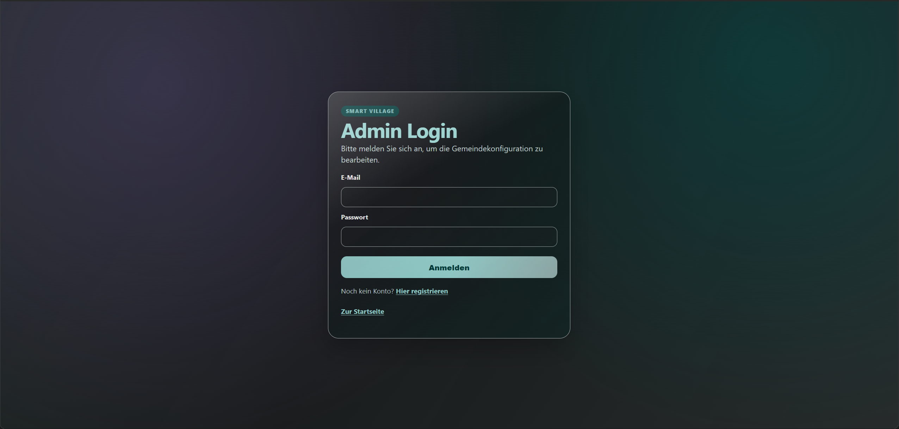
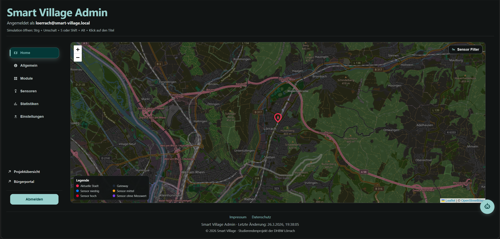
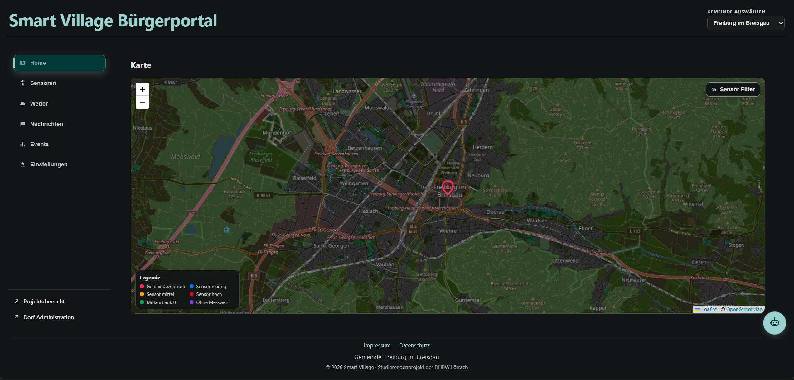

# Smart Village
**Studienarbeit · DHBW Lörrach · Kurs TIF 23 · Semester 5 & 6**

Smart Village ist eine IoT-Plattform für ländliche Gemeinden zur Verwaltung von Sensoren, Geräten und kommunalen Informationen. Sie bietet ein webbasiertes Admin-Dashboard, eine öffentliche Website und eine Mobile App (Android). Das System unterstützt Echtzeit-Sensordaten über MQTT, Auto-Discovery von IoT-Geräten und eine Kartenansicht auf Basis von OpenStreetMap. Das Projekt ist dabei deutlich über einen typischen Smart-Village-Prototyp hinausgewachsen und befindet sich bereits auf einem fortgeschrittenen Smart-City-Niveau. Noch ausstehend sind ausgedehnte Nutzertests und Feldtests mit echter physischer Hardware — die Firewall des DHBW-Netzwerks hat entsprechende Tests während der Entwicklung erschwert.

---

## Team & Ansprechpartner

| Name | Schwerpunkt | Ansprechpartner für |
|------|-------------|---------------------|
| **Leon Kühn** | Projektleitung, Backend (NestJS), MQTT, Infrastruktur, Docker | Backend-API, MQTT-Integration, Deployment, Architektur |
| **Manuel Keßler** | Android Mobile App (Kotlin), App-Features | Mobile App, App-API |
| **Alexander Shimaylo** | IoT / Raspberry Pi, Sensorik, Dokumentation | Sensor-Anbindung, IoT-Hardware, Dokumentation |
| **Nico Röcker** | Design, öffentliche Website | UI-Design, Website |

- **Betreuender Dozent:** Herr Schenk, DHBW Lörrach  
- **Server:** Bereitgestellt von **Herr Dittrich** — Studiengangsleiter Informatik, DHBW Lörrach. Bei Fragen zu Server oder Server-Infrastruktur: Herr Dittrich kontaktieren.

---

## System-Zugänge

| Dienst | DHBW-Netz (Produktion) | Lokal (nach Setup) | Beschreibung |
|--------|----------------------|-------------------|--------------|
| Web-App / Admin-Dashboard | https://192.168.23.113 | https://localhost | Frontend inkl. Admin-Oberfläche |
| REST-API | https://192.168.23.113/api | https://localhost/api | Backend REST-API |
| API Health Check | https://192.168.23.113/api/health | https://localhost/api/health | Statusprüfung |
| MQTT Broker (TCP) | 192.168.23.113:1883 | localhost:1883 | IoT-Geräte-Anbindung |
| MQTT WebSocket | wss://192.168.23.113/mqtt | wss://localhost/mqtt | MQTT über WebSocket |
| MailHog (Test-Mail) | http://192.168.23.113:8025 | http://localhost:8025 | Test-Mailserver |

> Das Produktivsystem ist ausschließlich im DHBW-Netzwerk erreichbar.

## Vorschau

*Login-Seite*



*Admin-Dashboard – Verwaltung von Gemeinden, Geräten und Sensoren*



*Öffentliche Website mit Bürgerportal und Kartenansicht*



---

## Quickstart (lokales Setup)

```bash
# 1. Repository klonen
git clone https://github.com/Lucario18th/smart-village.git
cd smart-village
```

```bash
# 2. Umgebungsvariablen konfigurieren
cd infra
# Die bestehende Umgebungsvariablen-Datei liegt unter infra/smartvillage.env
# Hinweis: Keine .env.example vorhanden — smartvillage.env direkt bearbeiten
# infra/smartvillage.env öffnen und anpassen:
# DATABASE_URL, JWT_SECRET, SMTP-Konfiguration, MQTT_BROKER_URL
```

```bash
# 3. Alle Dienste starten
docker compose up -d
```

```bash
# 4. Datenbankmigrationen ausführen (nach erstem Start oder nach Schema-Änderungen)
docker compose exec backend npx prisma migrate deploy
```

```bash
# 5. Seed-Daten einspielen (optional, für Testdaten)
docker compose exec backend npx prisma db seed
```

```bash
# 6. Anwendung aufrufen
# Web-App:     https://localhost        (selbstsigniertes Zertifikat → Browser-Warnung bestätigen)
# API Health:  https://localhost/api/health
# MailHog:     http://localhost:8025
# MQTT Broker: localhost:1883
```

> ⚠️ **Häufige Fehlerquelle — Datenbankmigrationen:**  
> Die Prisma-Datenbankmigration war im Projektverlauf eine der häufigsten Fehlerquellen.  
> Nach jedem frischen Clone, nach Änderungen an `.env` oder nach Schema-Änderungen unbedingt  
> `docker compose exec backend npx prisma migrate deploy` ausführen.  
> Bei Problemen zuerst prüfen, ob PostgreSQL vollständig gestartet ist: `docker compose logs postgres`

---

## Dokumentation

| Dokument | Pfad | Inhalt |
|----------|------|--------|
| Hauptdokumentation (4MAT) | [`docs/PROJEKT-DOKUMENTATION.md`](docs/PROJEKT-DOKUMENTATION.md) | Projektvision, Architektur, Technologieentscheidungen, Endnutzer-Anleitung, Sensorintegration |
| Doku-Navigation | [`docs/README.md`](docs/README.md) | Übersicht und Einstiegspunkt für alle Dokumente |
| KI-Nutzung | [`docs/KI-NUTZUNG.md`](docs/KI-NUTZUNG.md) | Einsatz von GitHub Copilot, Agent Mode, Erkenntnisse, Probleme |
| Technische Detaildokumentation | [`doku-Neu/`](doku-Neu/) | Architektur, API-Referenz, Backend, Frontend, Betrieb, Prozesse |
| Semester-5-Konzeptphase | [`doku-Neu/abgabe-semester-5/` (Abgabe 5. Semester)](doku-Neu/abgabe-semester-5/) | Technologierecherche, LoRaWAN-Evaluation, erste Konzepte |
| Archiv (veraltet) | [`doku-Alt/`](doku-Alt/) | Dokumentation aus frühen Projektphasen — nicht mehr aktuell |
| Changelog | [`docs/aenderungen-2026-03-24.md`](docs/aenderungen-2026-03-24.md) | Letzte Änderungen |
| MQTT-Simulation (Freiburg) | [`simulations/mqtt-freiburg/`](simulations/mqtt-freiburg/) | Simulationsskripte zum Testen der MQTT-Integration mit simulierten Sensordaten — genutzt während der Entwicklungsphase zur Validierung des Broker-Setups ohne physische Hardware |
| Smoke-Test-Skripte | [`test-scripts/`](test-scripts/) | Shell- und Hilfsskripte für manuelle Smoke Tests gegen die laufende Instanz (API, MQTT, Health-Check) |

---

## Projektverlauf

- **Semester 5 — Ideen- und Recherchephase:** Evaluation von IoT-Protokollen (LoRaWAN, MQTT, Zigbee u. a.), Architekturkonzepte, Anforderungsanalyse, erster kleiner Prototyp.
- **Semester 6 — Umsetzungsphase:** Sehr ausführliche, iterative Implementierung des gesamten Systems — Backend, Web-App, Mobile App (Kotlin), Raspberry Pi-Integration mit echten Sensoren, Auto-Discovery, Kartenansicht (OpenStreetMap), KI-gestützte Tests, Security-Hardening, kontinuierliche Erweiterung bis zur finalen Präsentation. Das Projekt hat sich dabei deutlich über den ursprünglichen Smart-Village-Rahmen hinaus zu einem fortgeschrittenen System mit Smart-City-Umfang entwickelt.
