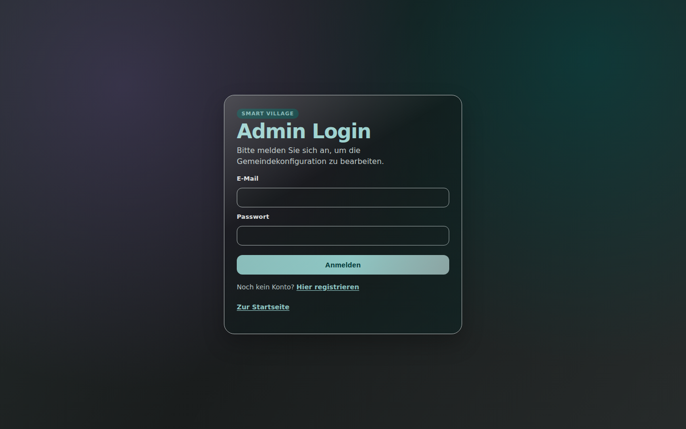
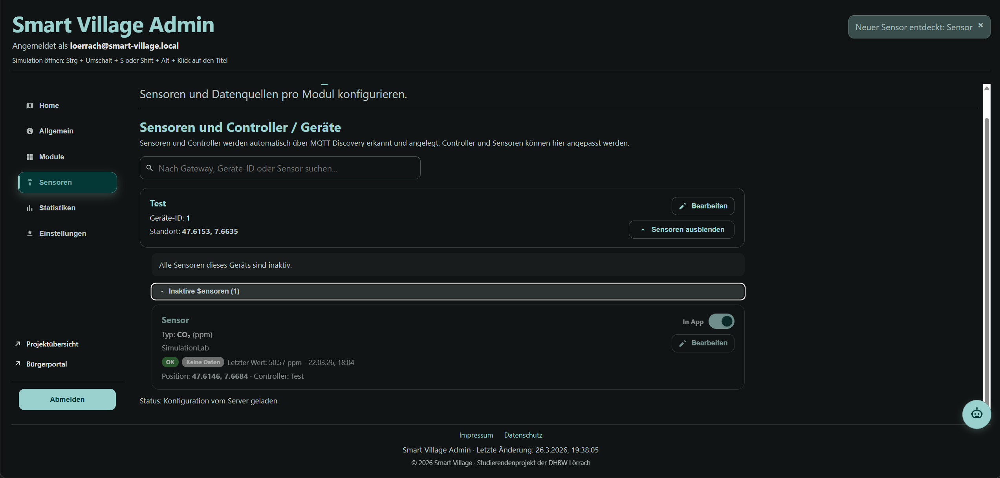
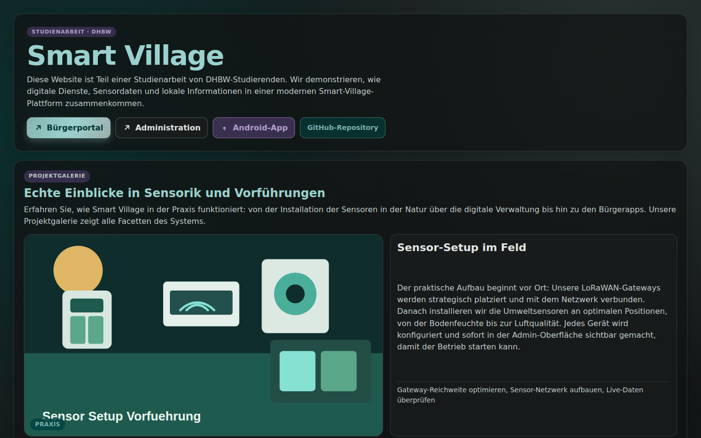
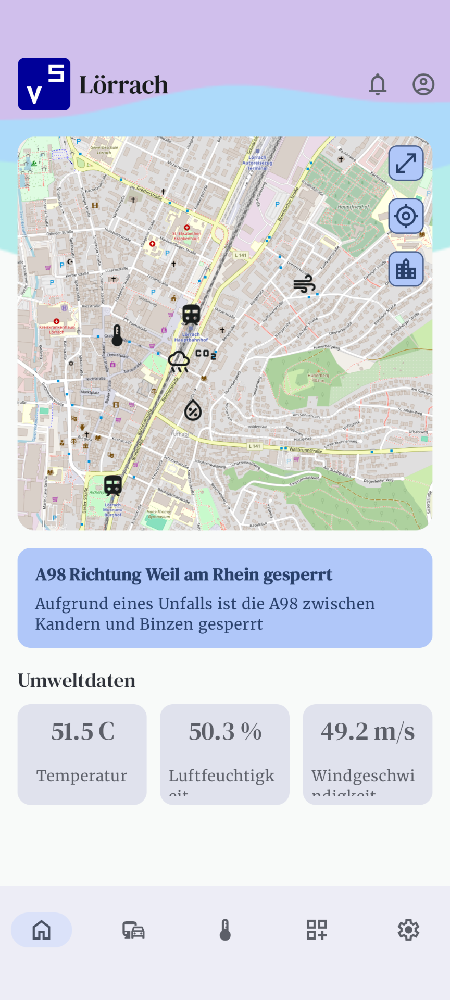
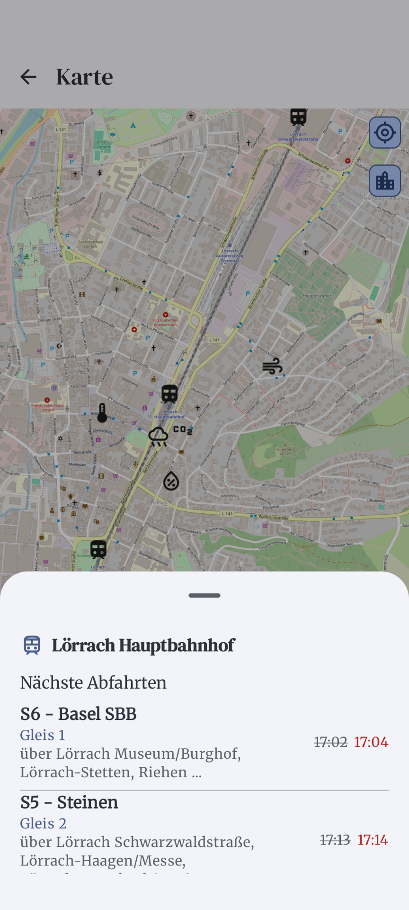

# Smart-Village Projektdokumentation

Dieses Dokument ist der zentrale Einstieg in das Smart-Village-Projekt der DHBW Lörrach. Es kombiniert Projektvision, Architektur, Designentscheidungen und eine praxisnahe Endnutzer-Anleitung.

Grundlage sind die bestehenden technischen Detaildokumente unter `doku-Neu/` sowie die aktuelle Codebasis.

---

## Screenshots

> Das System ist produktiv erreichbar unter [**https://192.168.23.113**](https://192.168.23.113) (DHBW-Netz, HTTPS Port 443).

### Login

*Login-Seite mit E-Mail-Verifizierung*


### Admin-Dashboard

*Administrationsbereich – Übersicht nach dem Einloggen*


### Geräteverwaltung

*Verwaltung von IoT-Geräten und MQTT-Devices*



### Sensorverwaltung

*Übersicht aller Sensoren mit Typ, Status und Sichtbarkeitseinstellungen*



### Öffentliche Website / Startseite

*Öffentliche Startseite mit Bürgerportal, Kartenansicht und Sensorübersicht*


### Öffentliche Kartenansicht (OpenStreetMap)

*Kartenansicht mit Gemeinde-Markern und Echtzeit-Sensorwerten*



### Mobile App (Android/iOS)

*Startbildschirm und Kartenansicht der Smart-Village App (Compose Multiplatform)*

  


***

## Projektstart – So wird das System gestartet

### Option A: Lokale Entwicklung (Docker)

**Voraussetzungen:** Docker, Docker Compose, Git, Android Studio mit Emulator

```bash
git clone https://github.com/Lucario18th/smart-village.git
cd smart-village/infra
# infra/smartvillage.env öffnen und Umgebungsvariablen anpassen:
# DATABASE_URL, JWT_SECRET, SMTP-Konfiguration, MQTT_BROKER_URL
docker compose up --build   # Alle Services starten
```

Start der App:
1. `smart-village/app/SmartVillageApp` in Android Studio öffnen
2. In `app/SmartVillageApp/composeApp/src/commonMain/kotlin/de/tif23/studienarbeit/model/constants/Url.kt` die Konstante `SERVER_URL` auf `https://localhost/api/app` setzen
3. Run-Konfiguration `app` auswählen und starten

Nach dem Start sind folgende Endpunkte erreichbar:

| Service | URL |
|---|---|
| Frontend | https://localhost |
| API | https://localhost/api |
| API Health | https://localhost/api/health |
| MailHog (E-Mail-Test) | http://localhost:8025 |
| MQTT TCP | localhost:1883 |
| MQTT WebSocket | wss://localhost/mqtt |

**MailHog – Hinweis:** MailHog ist ein lokaler E-Mail-Testserver und dient als Workaround, da das Projekt keine eigene Domain für den produktiven E-Mail-Versand besitzt. Die E-Mail-Verifizierung bei der Registrierung neuer Accounts wurde damit vollständig getestet und validiert – alle eingehenden Mails (Verifizierungs-Links, Passwort-Reset etc.) erscheinen in der MailHog-UI unter http://localhost:8025.

### Option B: Produktivbetrieb (DHBW-Netz)

Das System läuft bereits produktiv und ist ohne Setup erreichbar:

- **URL:** https://192.168.23.113
- **Netzwerk:** DHBW-internes Netz (kein VPN, kein externer Zugriff)
- **Port:** 443 (HTTPS)

Alle Komponenten (Backend, Frontend, Datenbank, MQTT-Broker) laufen containerisiert auf dem DHBW-Server.

**App:**
1. APK der App von den [GitHub-Releases](https://github.com/Lucario18th/smart-village/releases/tag/v1_0_1) herunterladen
2. VPN-Verbindung zum DHBW-Netz herstellen
3. App installieren und starten (benötigt Zugriff auf Standort)

***

## Ansprechpartner & Integration

### Teamübersicht

| Bereich | Ansprechpartner | Zuständigkeit |
|---|---|---|
| Backend & API | Leon Kühn | NestJS, Prisma, Authentifizierung, Deployment, Docker, Sicherheit |
| Frontend & UI | Nico Röcker | React, Vite, OpenStreetMap/Leaflet, UI/UX, öffentliche Kartenansicht |
| Mobile App | Manuel Keßler | Android-App (Version 1.0.1), Sensorübersicht, Gemeindeauswahl |
| IoT & Hardware | Alexander Shimaylo | Raspberry Pi Integration, MQTT-Client-Skripte, Sensor-Setup, Teile der Dokumentation |

### Technische Integrationspunkte

| Schnittstelle | Adresse | Hinweis |
|---|---|---|
| REST API (Produktion) | https://192.168.23.113/api | JWT Bearer Token erforderlich (außer öffentliche App-API) |
| REST API (lokal) | https://localhost/api | Nur im lokalen Docker-Setup |
| MQTT TCP (Produktion) | 192.168.23.113:1883 | Für IoT-Geräte im DHBW-Netz |
| MQTT WebSocket | wss://192.168.23.113/mqtt | Für Browser-basierte MQTT-Clients |
| Öffentliche App-API | https://192.168.23.113/api/app/villages | Kein Auth notwendig |

Für Integrationsfragen zur API: `doku-Neu/api/endpunkte.md`  
Für MQTT-Integration: `doku-Neu/backend/mqtt-integration.md`

---

## Teil 1: Projektübersicht nach 4MAT

## 1.1 WARUM - Der Bedarf und die Vision

### Problemstellung

Smart Village adressiert ein reales Problem vieler ländlicher und kleinerer Kommunen: Digitale Infrastruktur und datenbasierte Verwaltungsprozesse sind häufig weniger ausgebaut als in großen Städten.

Konkret entstehen dadurch folgende Herausforderungen:

- Sensorik- und Umweltdaten sind nicht zentral verfügbar.
- Daten aus Geräten, Kartenansichten und Verwaltungsprozessen sind nicht durchgängig verbunden.
- Bürger erhalten wichtige Informationen nicht immer zeitnah und transparent.
- Kommunen haben hohe Einstiegsbarrieren bei IoT-Integration.

### Vision und Ziele

Das Ziel von Smart Village ist eine integrierte Plattform, mit der Kommunen:

- IoT-Infrastruktur strukturiert verwalten,
- Sensordaten zuverlässig erfassen und auswerten,
- Verwaltungsinformationen digital und nachvollziehbar bereitstellen,
- sowie Bürgerzugang über Website und App standardisiert umsetzen können.

### Wer profitiert?

- Gemeinden/Kommunen: technische und fachliche Verwaltungsoberfläche
- Bürger: transparente öffentliche Informationen und aktuelle Messdaten
- Entwicklerteams: modularer, dokumentierter Aufbau für Wartung und Erweiterung

### Identifizierte Use Cases

- Gemeinde-Dashboard für Sensoren, Geräte, Karten und Statusmeldungen
- MQTT-gestützte Auto-Discovery neuer IoT-Geräte
- Raspberry-Pi-Integration als Praxisbeispiel für kommunale IoT-Einstiege
- Smart-City-Inspiration (Rostock) für übertragbare Smart-Village-Szenarien
- Digitale kommunale Rückmeldung (Informationsbereitstellung und Einordnung von Feedback)

## 1.2 WAS - Das System und seine Funktionen

### Kernfunktionen

- Verwaltung von Gemeinden (Village)
- Registrierung/Anmeldung mit E-Mail-Verifizierung
- Verwaltung von Geräten (Device) und Sensoren (Sensor)
- Speicherung von Messwerten als Zeitreihe (SensorReading)
- MQTT-Ingestion für IoT-Daten
- Auto-Discovery für neue Geräte/Sensoren
- Admin-Dashboard und Public-Ansicht
- App-API für Public-Website und mobile Clients
- Kartenvisualisierung mit OpenStreetMap

### Hauptkomponenten

- Backend: NestJS, Prisma, PostgreSQL/TimescaleDB, MQTT
- Frontend: React, Vite, Leaflet/OpenStreetMap
- Mobile: Android App (Version 1.0.1)
- Infrastruktur: Docker Compose, Nginx, Mosquitto, MailHog

### Datenmodell (Kurzüberblick)

Zentrale Entitäten:

- Account
- Village
- Device
- Sensor
- SensorType
- SensorReading

Kernbeziehungen:

- Ein Account verwaltet eine oder mehrere Villages.
- Eine Village enthält Devices und Sensors.
- Ein Device kann mehrere Sensors enthalten.
- Ein Sensor erzeugt viele SensorReadings.

Details: `../doku-Neu/architektur/datenmodell.md`

## 1.3 WIE - Architektur und technische Umsetzung

### High-Level-Architektur

- Backend stellt REST-Endpunkte bereit und konsumiert MQTT-Nachrichten.
- Frontend (SPA) ruft API/App-API auf und visualisiert Daten inkl. Karten.
- Datenbank speichert Stammdaten und Zeitreihen.
- MQTT-Broker verbindet IoT-Geräte mit dem Backend.
- Nginx dient als Reverse Proxy, TLS-Endpunkt und Sicherheitsgrenze.

### Deploymentmodell

Standard-Setup über Docker Compose mit typischen Diensten:

- `nginx`
- `backend`
- `postgres`
- `mosquitto`
- `mailhog`

Typische lokale Endpunkte:

- Frontend: `https://localhost`
- API: `https://localhost/api/...`
- Health: `https://localhost/api/health`
- MailHog: `https://localhost:8025`
- MQTT TCP: `localhost:1883`
- MQTT WebSocket (via Nginx): `wss://localhost/mqtt`

Details: `../doku-Neu/architektur/infrastruktur.md`, `../doku-Neu/betrieb/deployment.md`

### Sicherheit (aktueller Stand)

- JWT-basierte Authentifizierung mit Guards
- E-Mail-Verifizierung für neue Konten
- Eingabevalidierung über DTOs/Validation Pipe
- SQL-Hardening (parametrisierte Queries, keine unsichere Raw-Query-Nutzung)
- Sicherheitsheader via Helmet/Nginx (u. a. HSTS, nosniff, X-Frame-Options)
- Container-Hardening (npm ci, reduzierte Runtime, Non-Root-User)
- Rate-Limiting am Edge (Nginx)

Details: `../doku-Neu/betrieb/sicherheit.md`, `../doku-Neu/aenderungen-2026-03-18.md`

### Exemplarischer Datenfluss

IoT-Gerät -> MQTT -> Backend -> Datenbank -> REST/App-API -> Frontend/App

Praxisbeispiel (Sensorwerte):

1. Gerät publiziert an Topic `sv/{accountId}/{deviceId}/sensors/{sensorId}`.
2. Backend validiert Topic und Payload.
3. Messwert wird als SensorReading gespeichert.
4. Frontend/App aktualisieren Darstellung per Polling (und teilweise MQTT-WebSocket-Livewerten).

## 1.4 WAS-WENN - Erweiterbarkeit und Zukunft

### Skalierbarkeit

Das aktuelle Design ist für mehrere Gemeinden nutzbar (mandantennahe Trennung via Account/Village).

Ausbaustufen:

- horizontale Skalierung des Backends
- strengere Auth/ACL pro Village
- DB-Optimierung und ggf. Read-Modelle
- späterer Schnitt zu Microservice-orientierten Bausteinen

### Erweiterungsmöglichkeiten

- neue Sensortypen und Fachmodule
- weitere IoT-Protokolle (z. B. LoRaWAN/Zigbee-Gateways)
- erweiterte Analytics und Alerting
- Mobile-API-Redesign (bereits als künftige Aufgabe benannt)

### Lessons Learned / offene Punkte

- Kommunale Abstimmungsprozesse brauchen realistisch mehr Zeit als geplant.
- Technische Funktionsfähigkeit allein reicht nicht; organisatorischer Fit ist entscheidend.
- Sicherheit wurde bereits gehärtet, aber verbleibende Punkte (z. B. MQTT-Auth in Produktion) sind relevant.

### Konkrete technische Herausforderungen

- **Datenbankmigrationen (Prisma):** Schema-Änderungen bei laufendem System mit bestehenden Daten führten mehrfach zu Migrationskonflikten. Lösung: Migrationen immer zuerst mit `--create-only` prüfen, Produktionsdaten vor `migrate deploy` sichern. Dies war eine der häufigsten Fehlerquellen im gesamten Projektverlauf.
- **KI-Rate-Limits & Token-Budget:** Die Token-Limits und Rate-Limits der verwendeten KI-Modelle (GPT-4, Claude) waren der größte operative Engpass beim KI-gestützten Entwickeln. Abhilfe: Prompts präzise scopen, Kontext auf das Notwendige reduzieren, große Aufgaben in kleinere Teilaufgaben aufteilen.
- **Ollama (lokale KI):** Es wurde versucht, ein lokales KI-Modell (Ollama) auf dem Projektserver zu betreiben, um eine KI-Funktion direkt ins System zu integrieren. Das Vorhaben scheiterte am verfügbaren RAM des Servers – sinnvolle Modelle (7B+ Parameter) konnten nicht geladen werden.
- **MQTT-Authentifizierung:** Mosquitto läuft im aktuellen Setup ohne ACL/Passwortschutz. Für einen produktiven Einsatz außerhalb des DHBW-Netzes muss Mosquitto-Auth konfiguriert werden.
- **Kommunale Abstimmung:** Rückmeldungen von kontaktierten Gemeinden kamen sehr langsam oder gar nicht. Use Cases mussten daher teilweise ohne direkte Nutzer-Validierung aus sekundären Quellen entwickelt werden.

---

## Teil 2: Designentscheidungen und Technologievergleiche

Hinweis: Die Spalte "gewählt" basiert auf der aktuellen Codebasis. Die Spalte "nicht gewählt" dokumentiert im Projektkontext bewertete Alternativen.

## 2.1 Backend-Framework

| Technologie | Gewählt? | Begründung |
|---|---|---|
| NestJS | Ja | Modulare Architektur, TypeScript-nativ, Guards/Pipes/DI out-of-the-box, gute Integration mit Prisma und MQTT. |
| Express.js | Nein | Zu low-level für den gewünschten strukturierten Modulansatz; mehr Boilerplate für Validation/Security-Patterns. |
| Fastify (direkt) | Nein | Sehr performant, aber für den Projektkontext weniger naheliegend als NestJS als strukturierender Rahmen. |
| Django | Nein | Team- und Stack-Fokus auf TypeScript in Backend und Frontend. |

## 2.2 ORM / Datenzugriff

| Technologie | Gewählt? | Begründung |
|---|---|---|
| Prisma | Ja | Type-safe Client, klare Migrationen, gutes Schema-Management, starke DX mit TypeScript. |
| TypeORM | Nein | Im Projektkontext weniger konsistente Type-Safety und Migrationserfahrung als mit Prisma. |
| Sequelize | Nein | Älteres API-Gefühl und schwacherer TypeScript-Komfort im Vergleich zu Prisma. |
| Raw SQL als Standardzugriff | Nein | Höheres Fehler- und Sicherheitsrisiko, geringere Wartbarkeit. |

## 2.3 Datenbank

| Technologie | Gewählt? | Begründung |
|---|---|---|
| PostgreSQL (+ TimescaleDB) | Ja | Robuste relationale Basis, gute Zeitreihen-Eignung, Prisma-kompatibel, produktionsbewährt. |
| MySQL | Nein | Für den Projektkontext weniger attraktiv bei Zeitreihen-/Erweiterungsanforderungen. |
| MongoDB | Nein | Datenmodell ist klar relational (Account/Village/Device/Sensor/Reading). |
| SQLite | Nein | Nicht für produktionsnahe Multi-User-Szenarien dieser Art gedacht. |

## 2.4 Frontend-Framework

| Technologie | Gewählt? | Begründung |
|---|---|---|
| React | Ja | Grosse Community, komponentenbasierte Architektur, Teamerfahrung, gute Karten-/API-Integration. |
| Vue.js | Nein | Solide Alternative, aber im Projekt weniger Teamfokus als React. |
| Angular | Nein | Für Projektgröße zu schwergewichtig und mit höherem Overhead. |
| Svelte | Nein | Gutes Konzept, aber kleineres Ökosystem im Projektkontext. |

## 2.5 Build-Tool Frontend

| Technologie | Gewählt? | Begründung |
|---|---|---|
| Vite | Ja | Sehr schnelle Dev-Zyklen, moderne ESM-Basis, einfache Konfiguration. |
| Webpack | Nein | Höherer Konfigurations- und Build-Aufwand im Vergleich zu Vite. |
| Create React App | Nein | Für moderne Projektanforderungen nicht mehr erste Wahl. |

## 2.6 IoT-Kommunikation

| Technologie | Gewählt? | Begründung |
|---|---|---|
| MQTT | Ja | Leichtgewichtig, IoT-Standard, Publish/Subscribe passend für Sensorstreams und Discovery. |
| REST als primärer IoT-Transport | Nein | Für kontinuierliche Sensordaten ineffizienter als MQTT. |
| WebSockets als primäre Device-Anbindung | Nein | Für Embedded-IoT weniger standardisiert als MQTT im Projektkontext. |
| CoAP | Nein | Im Projekt nicht priorisiert, kleineres direktes Team-/Tooling-Setup. |

## 2.7 Authentifizierung

| Technologie | Gewählt? | Begründung |
|---|---|---|
| JWT | Ja | Stateless Ansatz, gut mit NestJS Guards kombinierbar, API-/App-kompatibel. |
| Session/Cookie-basiert (serverseitig) | Nein | Höherer operativer Aufwand für Session-Store und API-Patterns. |
| OAuth2/OIDC als Kernauth | Nein | Für den aktuellen Scope ohne Drittanbieter-Login überdimensioniert. |

## 2.8 Containerisierung / Deployment

| Technologie | Gewählt? | Begründung |
|---|---|---|
| Docker + Docker Compose | Ja | Reproduzierbares Setup für Entwicklung/Betrieb, einfache Inbetriebnahme. |
| Kubernetes | Nein | Für Projektgröße und Betriebsaufwand derzeit zu komplex. |
| Bare-Metal/ohne Container | Nein | Schlechter reproduzierbar, höherer Setup- und Drift-Aufwand. |

## 2.9 Reverse Proxy / Webserver

| Technologie | Gewählt? | Begründung |
|---|---|---|
| Nginx | Ja | Stabil, performant, klare Proxy-/TLS-/Security-Header-Konfiguration. |
| Apache | Nein | Im Projektkontext nicht priorisiert gegenüber Nginx. |
| Caddy | Nein | Gute Option, aber Team/Projektkonfiguration bereits auf Nginx ausgerichtet. |

## 2.10 Styling / UI-Ansatz

| Technologie | Gewählt? | Begründung |
|---|---|---|
| Custom CSS (inkl. Theme-System) | Ja | Im Projekt umgesetzt; volle Kontrolle über Design und Kontraste. |
| Tailwind CSS | Nein | Keine Nutzung in package.json oder Komponentenstruktur erkennbar. |
| Material-UI | Nein | Keine Nutzung in package.json; UI ist komponenten- und CSS-basiert umgesetzt. |
| Bootstrap | Nein | Nicht im Build/Styling-Stack enthalten. |

## 2.11 Mobile Mobile App Framework

| Technologie | Gewählt? | Begründung                                                                                                                               |
|---|---|------------------------------------------------------------------------------------------------------------------------------------------|
| Compose Multiplatform (KMP) | Ja | Ermöglicht weitreichendes Code-Sharing zwischen Android und iOS via Kotlin, moderne deklarative UI.                                      |
| React Native | Nein | Obwohl React im Frontend genutzt wird, fiel die Wahl auf KMP für bessere native Performance, Kotlin-Fokus und Erfahrung des Entwicklers. |
| Flutter | Nein | Erfordert Dart-Kenntnisse; das Team präferierte das Kotlin-Ökosystem.                                                                    |
| Native (Swift & Kotlin getrennt) | Nein | Zu hoher Entwicklungs- und Wartungsaufwand für zwei separate Codebasen im Projektrahmen.                                                 |

---

## Teil 3: Endnutzer-Anleitung - Sensoren und Geräte einbinden

Zielgruppe dieses Teils: Gemeinde-Administratoren mit wenig bis mittlerem technischen Vorwissen.

## 3.1 Überblick: Sensoren und Anwendungsfälle

| Sensortyp | Beispiel-Hardware | Anwendungsfall | Datenformat |
|---|---|---|---|
| Temperatur | DHT22, BME280, BMP280 | Wetterstation, Ortsklima | float (Grad C) |
| Luftfeuchtigkeit | DHT22, BME280 | Klimaüberwachung | float (Prozent) |
| Luftdruck | BMP280, BME280 | Wettertrend | float (hPa) |
| Bodenfeuchte | YL-69/LM393, kapazitive Sensoren | Bewässerung, Grünflächen | float (Prozent bzw. projektabhängig) |
| CO2 | MH-Z19, SCD30 | Luftqualität | float/int (ppm) |
| Mitfahrbank | projektspezifische Erfassung | Mobilitäts-Usecase | int (Personen) |
| Wind / Regen / Solar (optional je Hardware) | Wettermodule | Umweltmonitoring | float |

Hinweis: In der Seed-Konfiguration sind u. a. Temperature, Humidity, Pressure, Rainfall, Wind Speed, Solar Radiation, Soil Moisture, CO2 und Mitfahrbank vorgesehen.

## 3.2 Hardware-Empfehlungen für IoT-Gateways

| Gerät | Geeignet für | Vorteile | Nachteile |
|---|---|---|---|
| Raspberry Pi 5 | Zentrale Sensor-Knoten, MQTT-Gateway | Leistungsstark, viele Schnittstellen, gute Community | Höherer Stromverbrauch |
| Raspberry Pi Zero W | Kleine Sensor-Nodes | Geringe Kosten, kompakt | Weniger Rechenleistung |
| ESP32 | Einfache, stromsparende Sensor-Nodes | Sehr günstig, WLAN/Bluetooth | Begrenzte Ressourcen |
| Arduino + Netzwerkmodul | Sehr einfache Einzelsensoren | Niedrige Einstiegshürde | Geringere Flexibilität für komplexere Workflows |

## 3.3 Schritt-für-Schritt: Sensor mit Raspberry Pi 5 einbinden

### Schritt 1: Hardware vorbereiten

- Raspberry Pi installieren und ins Netzwerk bringen.
- Sensoren anschließen (z. B. BMP280 via I2C, Bodenfeuchte digital an GPIO).
- Sensorbibliotheken installieren.

Praxisreferenz: `../Raspberry PI/Doku/Derzeitiger_Stand.md`

### Schritt 2: MQTT-Client konfigurieren

Im Pi-Skript mindestens setzen:

- `MQTT_URL`
- `ACCOUNT_ID`
- `DEVICE_ID`
- `SENSOR_ID`
- `PUBLISH_INTERVAL`

Typische Topics im Projekt:

- Discovery: `sv/{accountId}/{deviceId}/config`
- Messwert: `sv/{accountId}/{deviceId}/sensors/{sensorId}`

### Schritt 3: Gerät im Backend anlegen

Im Adminbereich:

1. anmelden,
2. zu Geräteverwaltung wechseln,
3. neues Gerät mit eindeutiger `deviceId` anlegen,
4. Position/Name setzen.

Alternativ kann das Gerät per Discovery automatisch erstellt werden.

### Schritt 4: Sensor zuordnen und freigeben

Im Adminbereich Sensor anlegen oder über Discovery übernehmen:

- passender Sensortyp,
- eindeutige Sensor-ID,
- optional Beschreibung und Position,
- für Public/App-Sichtbarkeit `exposeToApp` aktivieren.

### Schritt 5: Auto-Discovery (optional)

Wenn Discovery genutzt wird:

1. Gerät sendet initiale Config-Payload,
2. Backend erkennt Device/Sensor,
3. Administrator prüft und finalisiert Sichtbarkeit/Felder.

Details: `../doku-Neu/prozesse/auto-discovery.md`

### Schritt 6: Daten verifizieren

- Im Admin-Dashboard prüfen, ob Werte eintreffen.
- `dataStale` sollte nach aktuellen Messungen auf `false` gehen.
- Public-Ansicht prüfen: Sensor sichtbar, wenn `exposeToApp = true` und Feature-Freigaben aktiv sind.

## 3.4 Code-Beispiele für IoT-Geräte

### Beispiel A: Python (Raspberry Pi, Temperatur + Luftfeuchtigkeit via MQTT)

```python
import time
import json
import paho.mqtt.client as mqtt

MQTT_URL = "mqtt://localhost:1883"
MQTT_HOST = "localhost"
MQTT_PORT = 1883
ACCOUNT_ID = "1"
DEVICE_ID = "weather-station-01"
TEMP_SENSOR_ID = 1001
HUM_SENSOR_ID = 1002

client = mqtt.Client()
client.connect(MQTT_HOST, MQTT_PORT, 60)

while True:
    # Beispielwerte (in Produktion echte Sensordaten lesen)
    temperature = 21.7
    humidity = 56.2

    ts = time.strftime("%Y-%m-%dT%H:%M:%SZ", time.gmtime())

    temp_payload = {
        "value": temperature,
        "ts": ts,
        "status": "OK",
        "unit": "C"
    }
    hum_payload = {
        "value": humidity,
        "ts": ts,
        "status": "OK",
        "unit": "%"
    }

    client.publish(
        f"sv/{ACCOUNT_ID}/{DEVICE_ID}/sensors/{TEMP_SENSOR_ID}",
        json.dumps(temp_payload),
        qos=0
    )
    client.publish(
        f"sv/{ACCOUNT_ID}/{DEVICE_ID}/sensors/{HUM_SENSOR_ID}",
        json.dumps(hum_payload),
        qos=0
    )

    time.sleep(60)
```

### Beispiel B: Node.js (generische Sensor-Publikation)

```javascript
const mqtt = require('mqtt');

const config = {
  broker: 'mqtt://localhost:1883',
  accountId: '1',
  deviceId: 'iot-node-01',
  sensorId: '2001'
};

const client = mqtt.connect(config.broker);

client.on('connect', () => {
  console.log('Connected to MQTT broker');

  setInterval(() => {
    const value = Number((20 + Math.random() * 5).toFixed(1));
    const payload = JSON.stringify({
      value,
      ts: new Date().toISOString(),
      status: 'OK',
      unit: 'C'
    });

    const topic = `sv/${config.accountId}/${config.deviceId}/sensors/${config.sensorId}`;
    client.publish(topic, payload, (err) => {
      if (err) {
        console.error('Publish error:', err);
      } else {
        console.log(`Published ${value} to ${topic}`);
      }
    });
  }, 60000);
});
```

Praxiscode im Repository:

- `../Raspberry PI/Code/soil_mqtt.py`
- `../Raspberry PI/Code/soil_local_test.py`

## 3.5 Troubleshooting

| Problem | Wahrscheinliche Ursache | Lösung |
|---|---|---|
| Sensor nicht sichtbar | `exposeToApp` deaktiviert | Sensor im Adminbereich freigeben |
| Sensor `dataStale = true` | Keine neuen Messwerte > ca. 60s | MQTT-Verbindung und Publisher-Skript prüfen |
| MQTT-Verbindung fehlschlägt | Falscher Broker/Port/TLS | `MQTT_URL`, Netzwerk und Ports prüfen |
| Discovery erkennt Gerät nicht | Payload/Topic ungültig | Topic-Format und Discovery-Payload gegen Doku prüfen |
| Messwerte kommen nicht an | Sensor-ID/Topic passt nicht zum Backend-Modell | IDs und Topic-Struktur konsistent halten |
| Login/Verifizierung klappt nicht | SMTP/MailHog oder Tokenproblem | MailHog, Auth-Konfiguration und Logs prüfen |

## 3.6 Weitere Ressourcen

- Rostock-Ressource: https://youtu.be/-ElfgOPmclA?si=9HY43XEayRAcq9en
- API-Referenz: `../doku-Neu/api/endpunkte.md`
- MQTT-Integration: `../doku-Neu/backend/mqtt-integration.md`
- Auto-Discovery: `../doku-Neu/prozesse/auto-discovery.md`
- Deployment: `../doku-Neu/betrieb/deployment.md`
- Sicherheitskonzept: `../doku-Neu/betrieb/sicherheit.md`

---

## Teil 4: KI-Einsatz im Projekt

### Überblick

KI-Tools wurden im Smart-Village-Projekt intensiv und strukturiert eingesetzt – sowohl in der Konzeptionsphase (Semester 5) als auch in der Implementierungsphase (Semester 6). Der Einsatz war dabei kein Experiment, sondern ein zentraler Teil des Entwicklungsworkflows.

### Eingesetzte Tools

| Tool | Einsatzbereich |
|---|---|
| GitHub Copilot (Chat & Agent Mode) | Implementierung, Refactoring, Security-Hardening, Testgenerierung |
| GitHub Copilot CLI | Kommandozeilen-Assistenz, Skript-Generierung, Docker-/Git-Befehle |
| Perplexity AI | Prompt Engineering, technische Recherche, strukturierte Anfragen |
| Claude / ChatGPT | Konzeptarbeit, Architekturreviews, Dokumentationsentwürfe |

### GitHub Copilot Agent Mode – Erfahrungen

GitHub Copilot im Agent Mode wurde für die Umsetzung ganzer Features genutzt:
- MQTT-Integration (Backend-Service, Topic-Parsing, Auto-Discovery)
- Security-Hardening (Helmet, HSTS, Rate-Limiting, Non-Root-Container)
- Automatische Generierung von DTOs, Guards und Validierungslogik

Der Agent Mode kann eigenständig mehrere Dateien planen, ändern, Befehle ausführen und iterieren – ein erheblicher Produktivitätsmultiplikator gegenüber klassischer Copilot-Vervollständigung.

**GitHub Copilot CLI** wurde parallel für Terminalaufgaben genutzt: Erklärung von Fehlermeldungen, Generierung von Shell-Skripten, Docker-Compose-Debugging und Git-Workflows.

### Prompt Engineering Workflow

Da unklar formulierte Prompts Token verschwenden und inkonsistente Ergebnisse liefern, wurde folgender Workflow etabliert:

1. **Problem/Feature in Perplexity AI beschreiben** → strukturierten, präzisen Copilot-Prompt erhalten
2. **Prompt in Copilot Agent einfügen** → autonome Ausführung mit klar definiertem Scope
3. **Ergebnis prüfen** → bei Bedarf Folge-Prompt mit konkreten Korrekturen
4. **Code-Review** → KI-generierter Code wird immer manuell überprüft, besonders sicherheitskritische Stellen

Perplexity AI hat sich dabei als ideales Tool für das Formulieren von Copilot-Prompts erwiesen: Die Antworten sind strukturiert, technisch präzise und berücksichtigen Scope und Token-Effizienz.

### Limitierungen & Erkenntnisse

- **Rate-Limits:** Das größte Problem im gesamten KI-Workflow. Bei intensiver Nutzung von GPT-4 und Claude wurden Rate-Limits regelmäßig erreicht, was Entwicklungsunterbrechungen verursachte. Lösung: Aufgaben in kleinere Einheiten zerlegen, Modelle wechseln.
- **Token-Budget:** Zu breite Prompts mit zu viel Kontext führen zu schlechterer Qualität und höheren Kosten. Klarer Scope und minimaler Kontext sind entscheidend.
- **Ollama (lokal):** Der Versuch, ein lokales KI-Modell auf dem Projektserver zu betreiben, schlug fehl – zu wenig RAM für 7B+ Modelle. Lokale KI erfordert dedizierte Hardware.
- **Code-Qualität:** KI-generierter Code ist meist korrekt, aber nicht immer optimal oder sicher. Besonders bei JWT-Handhabung, SQL-Queries und MQTT-Auth ist manuelle Überprüfung unerlässlich.
- **Architekturentscheidungen:** KI kann Optionen vorschlagen und abwägen, trifft aber keine guten übergeordneten Architekturentscheidungen ohne präzise menschliche Führung.

### Fazit

GitHub Copilot im Agent Mode in Kombination mit extern optimierten Prompts (via Perplexity AI) hat die Entwicklungsgeschwindigkeit erheblich gesteigert. KI ist kein Ersatz für Architekturverständnis oder Code-Review, aber ein enormer Beschleuniger bei der Implementierung. Die Kombination aus präzisen Prompts, Agent Mode und manueller Kontrolle hat sich als produktivster Workflow erwiesen und zeigt, wie weit KI-gestützte Entwicklung bereits heute in realen Studienprojekten angekommen ist.

---

## Anhang: Weiterführende Links

- Doku-Einstieg: `../doku-Neu/README.md`
- Projektübersicht: `../doku-Neu/uebersicht.md`
- Systemarchitektur: `../doku-Neu/architektur/system-uebersicht.md`
- Datenmodell: `../doku-Neu/architektur/datenmodell.md`
- App-API: `../doku-Neu/backend/app-api.md`
- App-Dokumentation: `../doku-Neu/app/uebersicht.md`, `../doku-Neu/app/architektur-entscheidungen.md`, `../doku-Neu/app/api-anbindungen.md`, `../doku-Neu/app/walkthrough.md`
- Änderungshistorie: `../doku-Neu/aenderungen-2026-03-15.md`, `../doku-Neu/aenderungen-2026-03-17.md`, `../doku-Neu/aenderungen-2026-03-18.md`, `../doku-Neu/aenderungen-2026-03-23.md`

---

## Kurzfazit

Smart Village verbindet technische IoT-Infrastruktur mit kommunaler Nutzbarkeit. Das System ist bereits funktional und dokumentiert, gleichzeitig offen für Erweiterungen bei Skalierung, Integrationen und mobilen Schnittstellen. Die Kombination aus modularer Architektur, klaren Prozessen und praxisnahen IoT-Workflows macht das Projekt sowohl für Entwicklungsteams als auch für kommunale Anwender gut einsetzbar.
