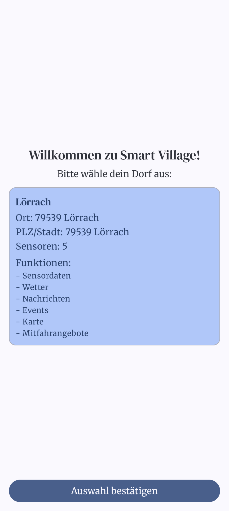
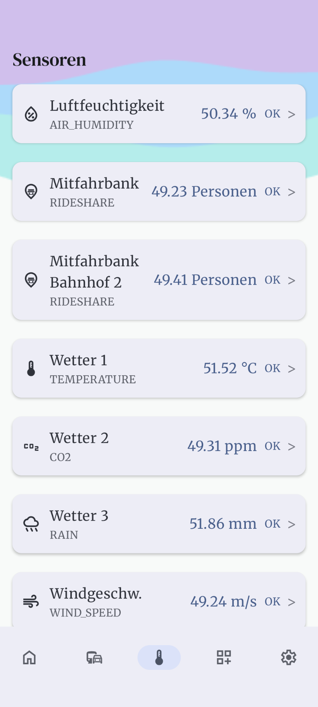
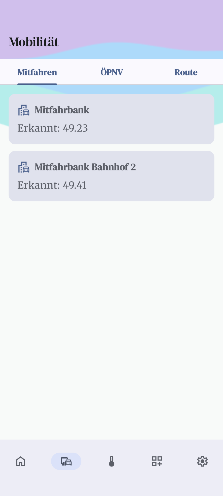
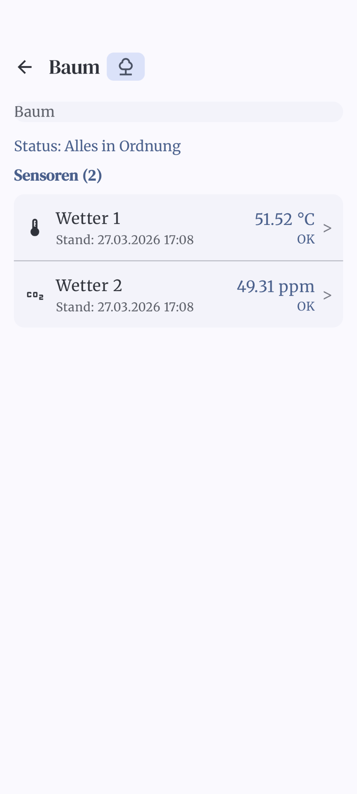

# App Walkthrough

Dieser Walkthrough führt durch die verschiedenen Screens der Smart Village App und beschreibt deren Funktionalitäten und Ansichten.

## 1. Splash Screen
Hierbei handelt es sich um den Startbildschirm der App, der beim Laden der Anwendung kurz angezeigt wird.
- **Funktionen:** Initialisierung der App-Komponenten, Laden von benötigten Daten aus dem Hintergrund.
- **Sichtbar:** Logo der Smart Village App, Ladeanimation.

## 2. Main Screen (Startseite / Dashboard)
Der Hauptbildschirm ist die zentrale Anlaufstelle der Anwendung.
- **Funktionen:** Navigation zu verschiedenen Modulen der App (Bottom Navigation oder Menü).
- **Sichtbar:** Übersicht über aktuelle Informationen, ggf. Shortcuts zu wichtigen Funktionen (wie Sensoren, Mobilität, Nachrichten).

## 3. Sensors Screen (Sensorübersicht)
Zeigt eine Übersicht aller verfügbaren Umweltdaten und Sensoren im Ort.
- **Funktionen:** Filtern und Auswählen bestimmter Sensoren um weitere Details zu betrachten.
- **Sichtbar:** Liste oder Kacheln der verschiedenen Sensoren (z. B. Luftqualität, Temperatur) mit aktuellen Messwerten.

## 4. Sensor Detail Screen (Sensordetails)
Detailansicht für einen spezifisch ausgewählten Sensor.
- **Funktionen:** Analyse der aufrecht erhaltenen Daten.
- **Sichtbar:** Detaillierte Graphen und historische Verläufe für den entsprechenden Sensor, Metadaten zum Sensor.

## 5. Mobility Screen (Mobilitätsübersicht)
Das zentrale Hub für jegliche Mobilitätsangebote der Gemeinde.
- **Funktionen:** Fortbewegen zu ÖPNV-Informationen oder Mitfahrgelegenheiten (Ridesharing).
- **Sichtbar:** Übersicht der Mobilitätsoptionen, Buttons/Karten für Haltestellen und Mitfahrbänke.

## 6. Station Departures Screen (ÖPNV Abfahrten)
Zeigt aktuelle Abfahrten für eine bestimmte Bus- oder Bahnhaltestelle.
- **Funktionen:** Echtzeit-Monitor der nächsten Abfahrten betrachten.
- **Sichtbar:** Liste der nächsten Linien (Bus/Bahn), Abfahrtszeiten und eventuelle Verspätungen.

## 7. Map Screen (Karte)
Kartenansicht des Dorfes bzw. der Gemeinde.
- **Funktionen:** Interaktives Navigieren und Entdecken von Point of Interests (Sensoren, Haltestellen, Mitfahrbänke).
- **Sichtbar:** Eine interaktive Karte mit Markern (Pins) für verschiedene intelligente Komponenten.

## 8. Modules Screen & Module Detail Screen (Module)
Übersicht und Detailansicht über zusätzlich in die App integrierte (vielleicht dynamisch geladene) Funktionsmodule.
- **Funktionen:** Aktivieren/Deaktivieren oder Nutzen von Erweiterungs-Plugins der App.
- **Sichtbar:** Auflistung der verfügbaren Module; bei Klick darauf öffnet sich der Detailbildschirm des jeweiligen Moduls.

## 9. Messages Screen (Nachrichten & Neuigkeiten)
Neuigkeiten, Ankündigungen und Systemmeldungen für die Dorfgemeinschaft.
- **Funktionen:** Lesen von Push-Nachrichten oder Bekanntmachungen aus dem Rathaus.
- **Sichtbar:** Scrollbare Liste (Feed) der letzten Nachrichten mit Datum und Kurzvorschau.

## 10. Settings Screen (Einstellungen)
Die Konfigurationszentrale der App.
- **Funktionen:** Anpassen der App-Präferenzen, Benachrichtigungseinstellungen und Themen (Dark/Light Mode). Impressum, Datenschutz und Login-Status.
- **Sichtbar:** Typische Einstellungs-Liste mit Switches, Checkboxen und Versioninfos.
